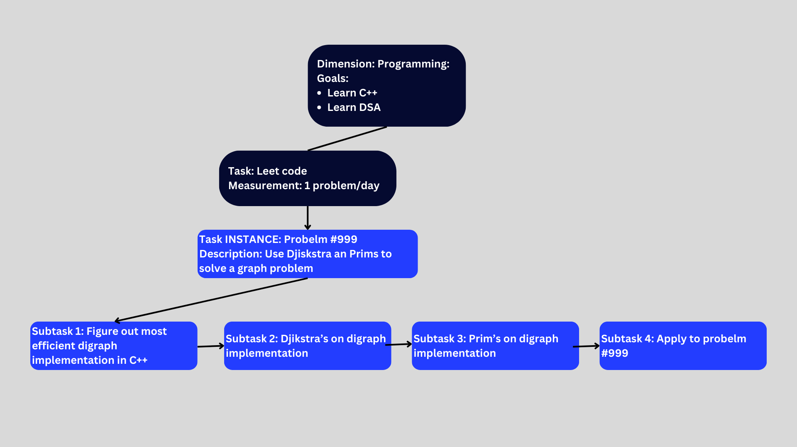

# Architecture of Focus App

Applying the following tree-like breakdowow for tasks:

Tasks will have reapeat="daily" attribute set by default. The app will update the task board daily. 

Categories (currently TaskGroup):
- high level objectives, these are categories.
- Ex. Projets, Programming, job applications.  
- Maybe a brief description of the categories importance to the user.

Tasks, these are measurable and recurrent tasks. 
- Programming
    - 1 Leet code question a day*
    - 1 Project commit to github*
    - Work on Notes project (1hr)*
- Job hunting:
    - 3 applications a day. 

Views:
TaskSection, updated daily:
- By default show all the tasks
- For each task, show its category, title, average completion time, status (completed, in progress, not started), and a button to start the task (starts timer and FocusedTaskView)

FocusedTaskView:
- Shows the task title, and a timer. 
- When the task is started, the timer starts. 
- When the task is completed, the timer stops and the time is recorded. 
- Maybe later you can add subtasks... not super important. 

